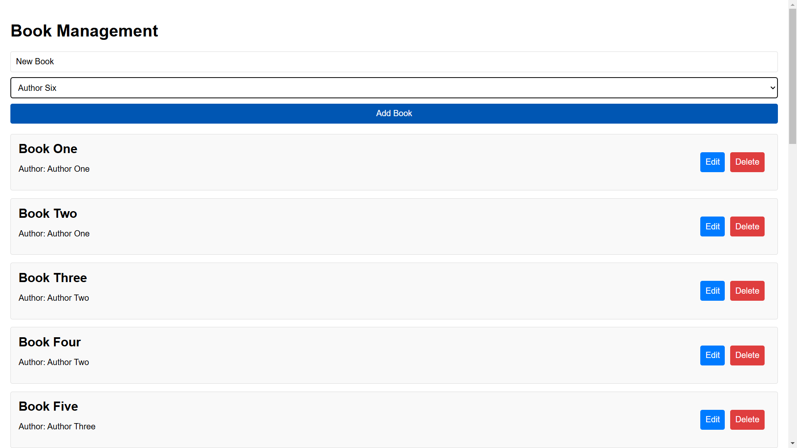
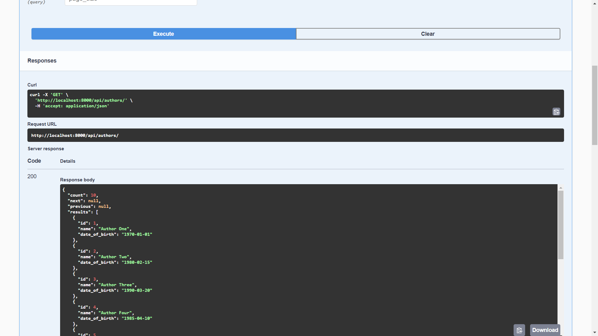
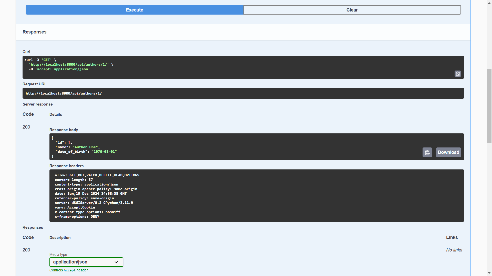
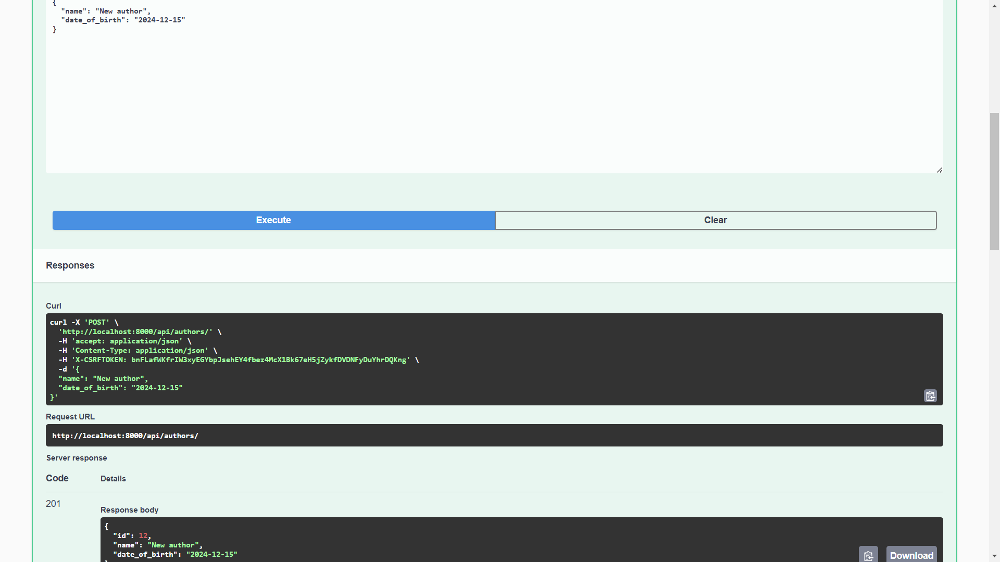
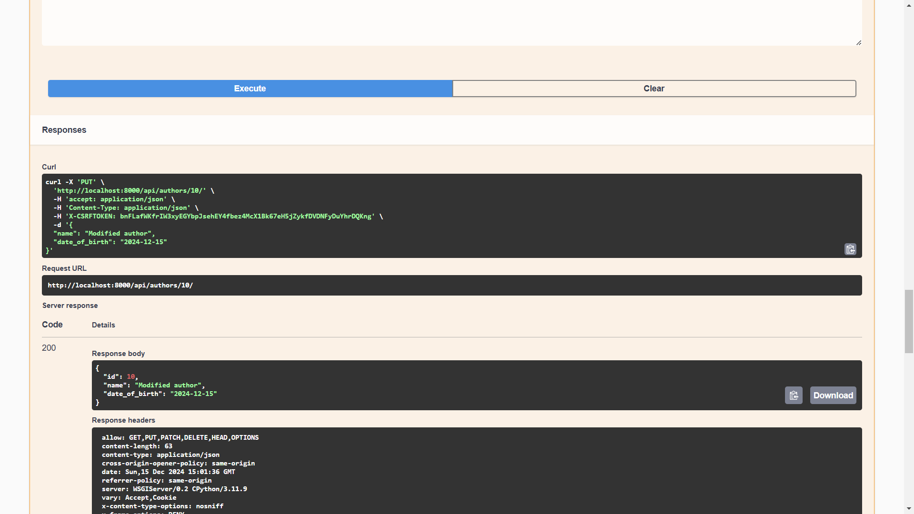
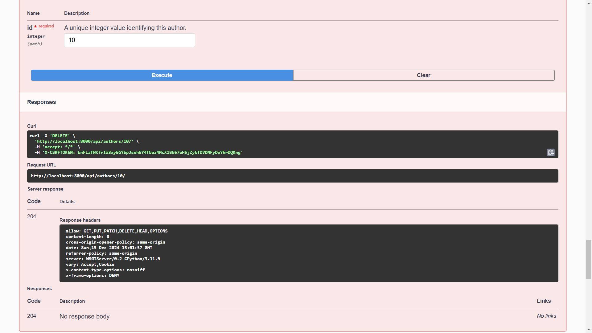

# Online english school project

Django Rest Framework project for book service API

## Admin credentials

* login: admin
* password: root1234

## Load data with this command

```shell
python manage.py loaddata app/fixtures/database.json
```

## Instalation

Python3 must be already installed

```shell
git clone https://github.com/ihorutkin/vean_task.git
cd vean_task
python3 -m venv venv
source venv/bin/activate
pip install -r requirements.txt
python manage.py runserver
```

## Run

Run Django server

```shell
python manage.py runserver
```

Run React server

```shell
npm start
```


## Features

* CRUD operations for the author's model:
  * Create, get, update, delete author.
* CRUD operations for the book model:
  * Creating, receiving, updating, deleting a book.
* The connection between the book and the author is carried out through a foreign key.
* Implemented serializers and views for models.
* Implemented routes for interacting with the API.
* Correct operation of connections between books and authors is ensured.
* Swagger documentation was added

## Demo React App



## Demo images (swagger)

### Get all authors



### Get detail author



### Create author



### Put author



### Delete author

